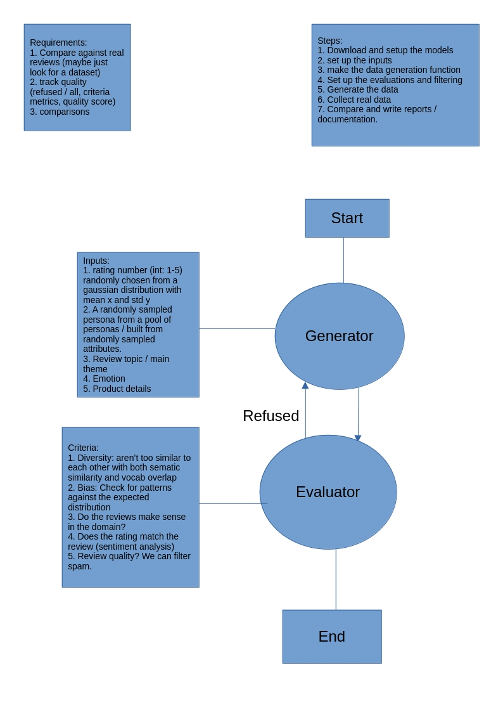

# Synthetic Data Generator with Quality Guardrails

This project implements a synthetic data generator designed to create realistic service/tool reviews (specifically for Canva) and evaluates them against real-world data using a suite of quality guardrails.

## Project Purpose

The objective is to build a configurable synthetic data pipeline that generates hundreds of samples, filters them through automated quality checks, and provides a comparative analysis against real-world reviews to track model performance and data realism.

## Setup

If you don't have **uv** installed, install it following [this guide](https://docs.astral.sh/uv/getting-started/installation/).

```bash
# Clone the repository
git clone https://github.com/A190nux/Product-Review-Data-Generation.git
cd Product-Review-Data-Generation

# Sync dependencies
uv sync

# Activate the virtual environment
# On Linux/macOS:
source .venv/bin/activate
# On Windows:
.venv\Scripts\activate

```

## Usage Examples

### To generate data:

```bash
python Generate_Data.py \
    --model rwkv \
    --config input_config.json \
    --output synthetic_rwkv_results.jsonl \
    --count 50

```

### To evaluate and compare data:

```bash
python compare_results.py \
    --synthetic synthetic_reviews.jsonl synthetic_reviews_2.jsonl \
    --real Canva.csv \
    --config input_config.json

```

---

## Initial Design



The idea is to make two nodes, a generator node that would take as input the following:
**Inputs:**

1. **Rating Number (int: 1-5):** Randomly chosen from a Gaussian distribution with mean  and std .
2. **Persona:** A randomly sampled persona from a pool of personas or built from randomly sampled attributes.
3. **Review Topic:** The main theme of the review.
4. **Emotion:** The emotional tone of the review.
5. **Product Details:** Specific information about the tool being reviewed.

Then the generated data would go to the **Evaluator Node** that would filter based on the following:
**Criteria:**

1. **Diversity:** Ensuring reviews aren’t too similar to each other with both semantic similarity and vocabulary overlap.
2. **Bias:** Checking for patterns against the expected distribution.
3. **Domain Realism:** Do the reviews make sense in the domain?
4. **Sentiment Alignment:** Does the rating match the review text (sentiment analysis).
5. **Review Quality:** Filtering for spam or low-effort content.

### Draft Plan Steps:

1. Download and setup the models.
2. Set up the inputs.
3. Make the data generation function.
4. Set up the evaluations and filtering.
5. Generate the data.
6. Collect real data.
7. Compare all the data.

---

## Actual Implementation

### Available Hardware:

* **RTX 2070** (8 GB VRAM)
* **RTX 5050** (8 GB VRAM)

Since I don't believe in using hosted LLMs for projects, this made a hard limit of the size of the models we could utilize. To maintain local control and privacy, I decided to use **Ollama** and a local inference engine called **Chirrup**, which is specifically designed for RWKV-7 models. You can find the link here: [https://github.com/leonsama/chirrup](https://github.com/leonsama/chirrup) — you will find me as one of the contributors there.

Another choice would have been **gpustack**, which uses vllm to make inference on multiple GPUs at the same time. This would have allowed me to take advantage of both GPUs simultaneously and remove much of the VRAM limitations by doubling it, but I found that its setup would take much longer than the deadline allowed.

### Model Choice:

1. **Ministral-8B:** I chose this as the primary model based on the [UncheatableEval leaderboards for small LLMs](https://huggingface.co/spaces/Jellyfish042/UncheatableEval). It had the highest score that would fit my VRAM limitations since, when used with Ollama, it comes automatically quantized to int4.
2. **RWKV-7 2.9B:** I chose this for the second model because it is exceptionally strong in creative writing. I am personally familiar with it and its specific inference engine.

### Framework:

I decided to use **DSPy** for this project. Since I am familiar with it, it removed the headache of writing complex instructions in prompts as plain text and allowed me to write the logic and instructions as code.

---

## Pipeline

As for the pipeline itself, it was supposed to be agentic, but due to time limitations, I had to make it strictly linear: the generator runs to completion, and then the evaluator is triggered.

### Input Configuration (`input_config.json`)

The generator is driven by a structured JSON configuration. The architecture of this file includes:

* **Sampling Parameters:** Defines the Gaussian distribution (mean: 3.5, std_dev: 1.1) used to select ratings.
* **Persona Buckets:** Hierarchical attributes including roles (Freelance Designer, Student, Pro-marketer), skill levels, and writing styles.
* **Review Themes Matrix:** Maps specific topics (UI/UX, Collaboration, Support) to keywords and specific pros/cons to give the LLM concrete details.
* **Product Knowledge Base:** Defines the "vibe" and specific UI elements of Canva to ensure domain realism.

The generator uses these by first sampling a rating, then building a persona profile, selecting a topic based on that rating, and finally injecting specific product details into the DSPy signature.

### Evaluator Logic

The evaluator processes the generated batch using the following criteria:

* **Diversity Check:** Uses `SentenceTransformer` (all-MiniLM-L6-v2) to calculate a cosine similarity matrix. Any review with a similarity score > 0.85 to another is rejected as a duplicate.
* **Sentiment Mismatch:** Uses `TextBlob` to check if the sentiment polarity contradicts the star rating (e.g., a 1-star review with highly positive text).
* **Domain Realism:** Validates reviews against a set of domain-specific keywords and calculates semantic similarity to a "domain centroid" derived from real data.
* **Quality Heuristics:** Flags reviews that are too short (< 4 words) or contain repetitive, "stuttering" text patterns.

---

## Results


### Detailed Quality Report

Below are the results as generated in the `Detailed_Quality_Report.md`:

**Target Rating Mean (Config):** 3.5

#### ## synthetic_reviews (Ministral)

* **Total Samples:** 400
* **Mean Rating:** 3.45
* **Mean Word Count:** 244.0
* **Distribution Alignment to Real Data (KS Test):** Stat=0.5832, p-val=0.0000
* ⚠️ Distributions are statistically DIFFERENT.


* **Avg Generation Time:** 7.849s
* **Avg Time Per Word:** 0.0331s/word
* **Est. Total Cost:** $0.20
* **Guardrail Rejection Rate:** 28.5%
* *Duplicates:* 78
* *Off-Topic:* 61
* *Sentiment Mismatch:* 1
* *Low Quality (Spam/Short):* 3


#### ## synthetic_reviews (RWKV)

* **Total Samples:** 400
* **Mean Rating:** 3.43
* **Mean Word Count:** 172.0
* **Distribution Alignment to Real Data (KS Test):** Stat=0.5707, p-val=0.0000
* ⚠️ Distributions are statistically DIFFERENT.


* **Avg Generation Time:** 7.753s
* **Avg Time Per Word:** 0.0458s/word
* **Est. Total Cost:** $0.20
* **Guardrail Rejection Rate:** 72.5%
* *Duplicates:* 268
* *Off-Topic:* 54
* *Sentiment Mismatch:* 0
* *Low Quality (Spam/Short):* 0


---

## Analysis

The choice for the review topic was **Canva**, largely because I was able to find a comprehensive [review dataset on Kaggle](https://www.kaggle.com/datasets/bagush/canva-mobile-app-reviews-google-play) for this product that contains over 60,000 reviews to serve as our real-world baseline.

**Key Observations:**

* **Rejection Rates:** The rejection rate is much higher for the RWKV model (72.5% vs 28.5%). This is likely due to the lower model size (2.9B), which resulted in significantly more semantic duplicates.
* **Distribution Mismatch:** Although we chose the rating distribution to be Gaussian (based on the Central Limit Theorem), the real data does not follow this pattern. In reality, most people choose either 1 or 5 stars, creating a "U-shaped" distribution rather than a bell curve.
* **Review Length & Quality:** Almost all real reviews are under 30 words and can be summarized simply as "good" or "bad" with no real descriptors. In contrast, the synthetic models tended to be much more verbose (Mean 170-244 words).
* **The Reality of Real Data:** It appears that a real data distribution of reviews naturally contains low quality, repetitive, and extremely short content. Our synthetic generator, while attempting to be high quality, actually produces data that is too different compared to actual user behavior.